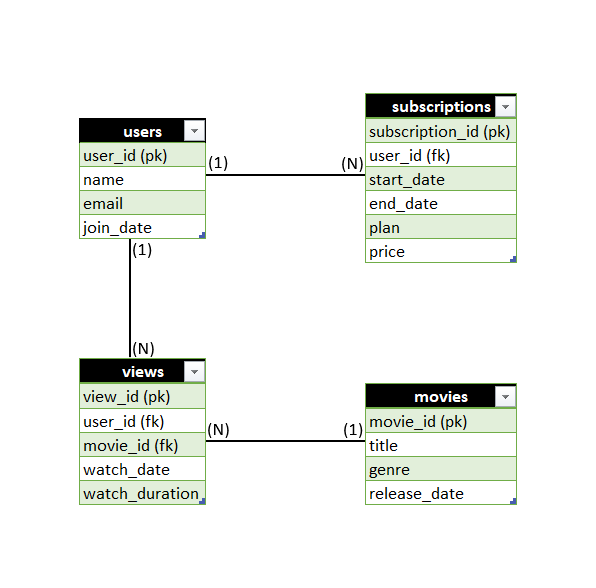

# Movie Streaming Platform – SQL Analytics Project

## Project Overview
This project simulates a Movie Streaming Platform database built using PostgreSQL.  
The goal of this project is to design a relational database and perform business analytics using SQL queries.

This project demonstrates:
- Database design (DDL)
- Data insertion (DML)
- Joins and Aggregations
- Subqueries
- Window Functions
- Business-oriented analytical queries

---

## Database Schema

### Users Table
| Column      | Description            |
|------------|------------------------|
| user_id     | Primary Key            |
| name        | User name              |
| email       | Unique email address   |
| join_date   | Registration date      |

### Movies Table
| Column        | Description        |
|--------------|--------------------|
| movie_id      | Primary Key        |
| title         | Movie title        |
| genre         | Movie genre        |
| release_year  | Release year       |

### Subscriptions Table
| Column           | Description                   |
|------------------|------------------------------|
| subscription_id  | Primary Key                  |
| user_id          | Foreign Key → users          |
| start_date       | Subscription start date      |
| end_date         | Subscription end date        |
| plan             | Plan type                    |
| price            | Subscription price           |

Relationship:
- One user can have multiple subscriptions.

### Views Table
| Column         | Description                  |
|---------------|------------------------------|
| view_id        | Primary Key                  |
| user_id        | Foreign Key → users          |
| movie_id       | Foreign Key → movies         |
| watch_date     | Date watched                 |
| watch_duration | Duration watched (minutes)   |

Relationships:
- One user can watch multiple movies.
- One movie can be watched by multiple users.
- Many-to-many relationship between users and movies through the views table.

---

## ER Diagram

Below is the Entity-Relationship (ER) Diagram representing the database structure:

### Description

The ER diagram visually represents:

- **Users** table (Primary Key: `user_id`)
- **Movies** table (Primary Key: `movie_id`)
- **Subscriptions** table (Foreign Key: `user_id`)
- **Views** table (Foreign Keys: `user_id`, `movie_id`)

### Relationships

- One user can have multiple subscriptions (One-to-Many).
- One user can watch multiple movies.
- One movie can be watched by multiple users.
- Users and Movies have a Many-to-Many relationship through the `views` table.

The ER diagram provides a clear blueprint of the database design before running analytical SQL queries.

---

## Analytical Queries Implemented

### Basic Analytics
- Total number of users
- Total subscription revenue
- Revenue by subscription plan

### Intermediate Analytics
- Most watched movie
- Top 3 most watched movies
- Average watch duration per user
- Total watch time per movie
- Most popular genre
- Users who watched more than 2 movies
- Active users in a specific month

### Advanced Analytics
- Movie ranking using RANK() / DENSE_RANK()
- Genre contribution percentage
- Top engaging users

---

## Business Insights
- Identify most popular content
- Analyze user engagement levels
- Track revenue distribution
- Understand genre preferences
- Monitor active users

---

## Technologies Used
- PostgreSQL
- SQL (DDL, DML, Joins, Subqueries, Window Functions)
- Excel (ER Diagram)
- GitHub

---

## Project Structure
Movie_Streaming_Platform_Analytics/
│
├── create_table.sql
├── insert_data.sql
├── analytics_query.sql
├── er_diagram.png
├── Movie_Streaming_Platform_Analytics_Project_Report.docx
└── README.md